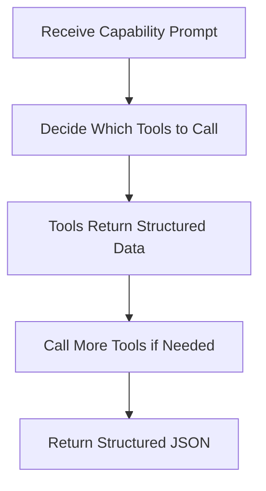

# Iris Agent System

The Iris Agent is the core intelligence of Git-Iris, built on the [Rig framework](https://docs.rs/rig-core) for agentic workflows.

**Source:** `src/agents/iris.rs`

## Design Philosophy

### One Agent to Rule Them All

Git-Iris uses a **unified agent architecture** with capability switching:

```rust
pub struct IrisAgent {
    provider: String,              // "openai", "anthropic", "google"
    model: String,                 // Primary model for complex tasks
    fast_model: Option<String>,    // Fast model for subagents
    current_capability: Option<String>, // Active capability
    provider_config: HashMap<String, String>,
    preamble: Option<String>,
    config: Option<Config>,
    content_update_sender: Option<ContentUpdateSender>,
}
```

**Benefits:**

- **Code reuse** — Tools, validation, and execution logic shared across all capabilities
- **Consistency** — Same decision-making process for commits, reviews, PRs, etc.
- **Maintainability** — Fix a bug once, it's fixed everywhere
- **Testability** — Test one agent with different prompts

### Stateless and Send-Safe

`IrisAgent` doesn't store the client builder — it creates it fresh each time using `DynClientBuilder::new()`. This design:

- Reads API keys from environment at call time
- Allows the agent to be used across async boundaries (`tokio::spawn`)
- Makes the agent `Send + Sync` safe

## Agent Lifecycle

### 1. Creation

```rust
// Direct creation
let agent = IrisAgent::new("anthropic", "claude-sonnet-4-5-20250929")?;

// With builder
let agent = IrisAgentBuilder::new()
    .with_provider("anthropic")
    .with_model("claude-sonnet-4-5-20250929")
    .with_preamble("Custom instructions...")
    .build()?;
```

### 2. Configuration

Agents can be configured with:

- **Fast model** for subagents: `agent.set_fast_model("claude-haiku-4-5-20251001")`
- **Config** for gitmoji/presets: `agent.set_config(config)`
- **Content update sender** for Studio chat mode: `agent.set_content_update_sender(sender)`

### 3. Execution

```rust
let response = agent.execute_task("commit", "Generate a commit message").await?;

match response {
    StructuredResponse::CommitMessage(msg) => {
        println!("{} {}", msg.emoji.unwrap_or_default(), msg.title);
    }
    _ => {}
}
```

### 4. Streaming (for TUI)

```rust
agent.execute_task_streaming("review", prompt, |chunk, aggregated| {
    // Update TUI with each text chunk
    print!("{}", chunk);
}).await?;
```

## Tool Attachment

Tools are attached when the agent is built:

```rust
fn build_agent(&self) -> Result<Agent<impl CompletionModel + 'static>> {
    let agent_builder = DynClientBuilder::new()
        .agent(&self.provider, &self.model)?
        .preamble(preamble)
        .max_tokens(16384);

    // Core tools (shared with subagents)
    let agent_builder = attach_core_tools!(agent_builder)
        .tool(DebugTool::new(GitRepoInfo))
        .tool(DebugTool::new(Workspace::new()))
        .tool(DebugTool::new(ParallelAnalyze::new(&self.provider, fast_model)))
        .tool(sub_agent); // Rig's built-in agent-as-tool!

    // Conditional tools for Studio chat mode
    if let Some(sender) = &self.content_update_sender {
        agent_builder
            .tool(DebugTool::new(UpdateCommitTool::new(sender.clone())))
            .tool(DebugTool::new(UpdatePRTool::new(sender.clone())))
            .tool(DebugTool::new(UpdateReviewTool::new(sender.clone())))
            .build()
    } else {
        agent_builder.build()
    }
}
```

### Tool Registry Pattern

The `attach_core_tools!` macro ensures consistency:

```rust
#[macro_export]
macro_rules! attach_core_tools {
    ($builder:expr) => {{
        $builder
            .tool(DebugTool::new(GitStatus))
            .tool(DebugTool::new(GitDiff))
            .tool(DebugTool::new(GitLog))
            .tool(DebugTool::new(GitChangedFiles))
            .tool(DebugTool::new(FileRead))
            .tool(DebugTool::new(CodeSearch))
            .tool(DebugTool::new(ProjectDocs))
    }};
}
```

**Prevents drift** — Main agents and subagents always have the same core tools.

## Multi-Turn Execution

Iris operates in **multi-turn mode**, allowing up to 50 tool calls:

```rust
let prompt_response = agent
    .prompt(&full_prompt)
    .multi_turn(50)        // Allow up to 50 tool calls
    .extended_details()    // Get token usage stats
    .await?;
```

### Execution Flow



| Step           | Action                            | Example                                            |
| -------------- | --------------------------------- | -------------------------------------------------- |
| **1. Receive** | Load prompt from capability TOML  | "Generate a commit message for staged changes..."  |
| **2. Decide**  | Iris selects which tools to call  | `project_docs()`, `git_diff()`, `git_log(count=5)` |
| **3. Execute** | Tools return structured data      | README content, diff with scores, recent commits   |
| **4. Iterate** | Call more tools based on findings | `file_read()` to examine specific files            |
| **5. Return**  | Generate structured JSON response | `{ emoji: "✨", title: "...", message: "..." }`    |

**Why 50 turns?** Complex capabilities like PRs and release notes may need to:

- Analyze 20+ changed files individually
- Read commit history across a feature branch
- Search for patterns in configuration files
- Spawn parallel subagents for deep analysis

Iris knows when to stop, so we provide generous headroom.

## Capability Loading

Capabilities are embedded at compile time and loaded dynamically:

```rust
fn load_capability_config(&self, capability: &str) -> Result<(String, String)> {
    let content = match capability {
        "commit" => CAPABILITY_COMMIT,
        "pr" => CAPABILITY_PR,
        "review" => CAPABILITY_REVIEW,
        "changelog" => CAPABILITY_CHANGELOG,
        "release_notes" => CAPABILITY_RELEASE_NOTES,
        "chat" => CAPABILITY_CHAT,
        "semantic_blame" => CAPABILITY_SEMANTIC_BLAME,
        _ => return Ok(("Generic prompt".to_string(), "PlainText".to_string())),
    };

    let parsed: toml::Value = toml::from_str(content)?;
    let task_prompt = parsed.get("task_prompt")...;
    let output_type = parsed.get("output_type")...;

    Ok((task_prompt.to_string(), output_type))
}
```

The tuple `(task_prompt, output_type)` determines:

- **What Iris is asked to do** (the prompt)
- **What format to return** (JSON schema type)

## Structured Output Generation

After tools are called, Iris must return valid JSON:

```rust
async fn execute_with_agent<T>(&self, system_prompt: &str, user_prompt: &str) -> Result<T>
where
    T: JsonSchema + DeserializeOwned + Serialize + Send + Sync + 'static,
{
    // Generate JSON schema for type T
    let schema = schema_for!(T);
    let schema_json = serde_json::to_string_pretty(&schema)?;

    // Instruct Iris to respond with JSON matching the schema
    let full_prompt = format!(
        "{system_prompt}\n\n{user_prompt}\n\n\
        === CRITICAL: RESPONSE FORMAT ===\n\
        REQUIRED JSON SCHEMA:\n{schema_json}\n\n\
        Your entire response should be ONLY the JSON object."
    );

    let response = agent.prompt(&full_prompt).multi_turn(50).await?;

    // Extract and validate JSON
    let json_str = extract_json_from_response(&response)?;
    let sanitized = sanitize_json_response(&json_str);
    let result: T = parse_with_recovery(sanitized.as_ref())?;

    Ok(result)
}
```

### JSON Extraction and Sanitization

**Extract:** Handles multiple formats

- Pure JSON: `{"emoji": "✨", ...}`
- Markdown code block: ` ```json\n{...}\n``` `
- With preamble: `Here's the commit message:\n{...}`

**Sanitize:** Fixes common LLM mistakes

- Literal newlines in strings → `\n`
- Unescaped control characters → Unicode escapes
- Tab characters → `\t`

**Validate:** Schema-aware recovery

- Missing fields → Add defaults
- Type mismatches → Coerce to expected type
- Null where not allowed → Replace with defaults

See [Output Validation](./output.md) for details.

## Style Injection

Iris adapts her output based on configuration:

```rust
fn inject_style_instructions(&self, system_prompt: &mut String, capability: &str) {
    let config = self.config?;
    let preset_name = config.get_effective_preset_name();
    let is_conventional = preset_name == "conventional";
    let gitmoji_enabled = config.use_gitmoji && !is_conventional;

    // Inject instruction preset
    if let Some(preset) = library.get_preset(preset_name) {
        system_prompt.push_str("\n\n=== STYLE INSTRUCTIONS ===\n");
        system_prompt.push_str(&preset.instructions);
    }

    // Handle gitmoji
    if gitmoji_enabled && capability == "commit" {
        system_prompt.push_str("\n\n=== GITMOJI INSTRUCTIONS ===\n");
        system_prompt.push_str("Set the 'emoji' field to a relevant gitmoji...");
        system_prompt.push_str(&get_gitmoji_list());
    }
}
```

**Presets** like `cosmic` or `playful` inject personality into Iris's language while maintaining structural requirements (72-char limit, imperative mood, JSON format).

## Subagent Creation

The agent builds a **sub-agent** as a tool:

```rust
let sub_agent_builder = client_builder
    .agent(&self.provider, fast_model)
    .name("analyze_subagent")
    .description("Delegate focused analysis tasks to a sub-agent...")
    .preamble("You are a specialized analysis sub-agent...")
    .max_tokens(4096);

let sub_agent = attach_core_tools!(sub_agent_builder).build();
```

**Key differences from main agent:**

- Uses **fast model** for cost efficiency
- Has **core tools** (git, file read) but no delegation tools (no recursion)
- **Smaller token limit** (4096 vs 16384)
- **Focused preamble** — "Complete the task, return concise summary"

The sub-agent is attached as a **tool**, allowing Iris to delegate:

```
Iris: "analyze_subagent({ task: 'Review database migrations in db/' })"
Sub-Agent: [Calls git_diff, file_read, returns focused summary]
Iris: [Incorporates sub-agent findings into final output]
```

## Provider-Specific Handling

### OpenAI Reasoning Models

For models like `o1` and `gpt-5`, Iris sets reasoning effort:

```rust
fn apply_reasoning_defaults<M>(&self, builder: RigAgentBuilder<M>) -> RigAgentBuilder<M> {
    if self.provider == "openai" && Self::requires_reasoning_effort(&self.model) {
        builder.additional_params(json!({
            "reasoning": { "effort": "low" }
        }))
    } else {
        builder
    }
}

fn requires_reasoning_effort(model: &str) -> bool {
    model.starts_with("gpt-5") || model.starts_with("gpt-4.1") || model.starts_with("o1")
}
```

This optimizes cost and latency for reasoning-capable models.

## Streaming Support

For real-time TUI updates:

```rust
pub async fn execute_task_streaming<F>(
    &mut self,
    capability: &str,
    user_prompt: &str,
    mut on_chunk: F,
) -> Result<StructuredResponse>
where
    F: FnMut(&str, &str) + Send,
{
    let agent = self.build_agent()?;
    let mut stream = agent.stream_prompt(&full_prompt).multi_turn(50).await;

    let mut aggregated_text = String::new();

    while let Some(item) = stream.next().await {
        match item {
            StreamedAssistantContent::Text(text) => {
                aggregated_text.push_str(&text.text);
                on_chunk(&text.text, &aggregated_text);
            }
            StreamedAssistantContent::ToolCall(tool_call) => {
                // Update status: "Calling git_diff..."
            }
            _ => {}
        }
    }

    // Convert aggregated text to structured response
    Ok(StructuredResponse::MarkdownReview(MarkdownReview {
        content: aggregated_text,
    }))
}
```

**Note:** Streaming mode returns markdown directly, not JSON, for simpler real-time display.

## Debug Instrumentation

All agent operations are instrumented for debugging:

```rust
use crate::agents::debug;

debug::debug_phase_change("AGENT EXECUTION: GeneratedMessage");
debug::debug_context_management("Agent built with tools", "Provider: anthropic...");
debug::debug_llm_request(&full_prompt, Some(16384));

let timer = debug::DebugTimer::start("Agent prompt execution");
let response = agent.prompt(&full_prompt).multi_turn(50).await?;
timer.finish();

debug::debug_llm_response(&response, duration, Some(total_tokens));
debug::debug_json_parse_success("GeneratedMessage");
```

Enable with `--debug` flag for color-coded execution traces.

## Testing Patterns

### Unit Tests

Test capability loading:

```rust
#[test]
fn loads_commit_capability() {
    let agent = IrisAgent::new("openai", "gpt-4o").unwrap();
    let (prompt, output_type) = agent.load_capability_config("commit").unwrap();
    assert!(prompt.contains("Generate a commit message"));
    assert_eq!(output_type, "GeneratedMessage");
}
```

### Integration Tests

Test full execution with mocked tools:

```rust
#[tokio::test]
async fn generates_commit_message() {
    let agent = IrisAgent::new("openai", "gpt-4o").unwrap();
    let response = agent.execute_task("commit", "Generate message").await.unwrap();

    match response {
        StructuredResponse::CommitMessage(msg) => {
            assert!(!msg.title.is_empty());
        }
        _ => panic!("Wrong response type"),
    }
}
```

## Error Handling

Agent errors are propagated with context:

```rust
// Provider error
Err(anyhow::anyhow!("Failed to create agent builder for provider '{}': {}", provider, e))

// JSON parsing error
Err(anyhow::anyhow!("No valid JSON found in response"))

// Validation error
Err(anyhow::anyhow!("Failed to parse JSON even after recovery attempts: {}", e))
```

All errors flow through `anyhow::Result` for rich error context.

## Next Steps

- [Capabilities](./capabilities.md) — How to create custom task definitions
- [Tools](./tools.md) — Building and registering tools for Iris
- [Output Validation](./output.md) — Schema validation and error recovery
