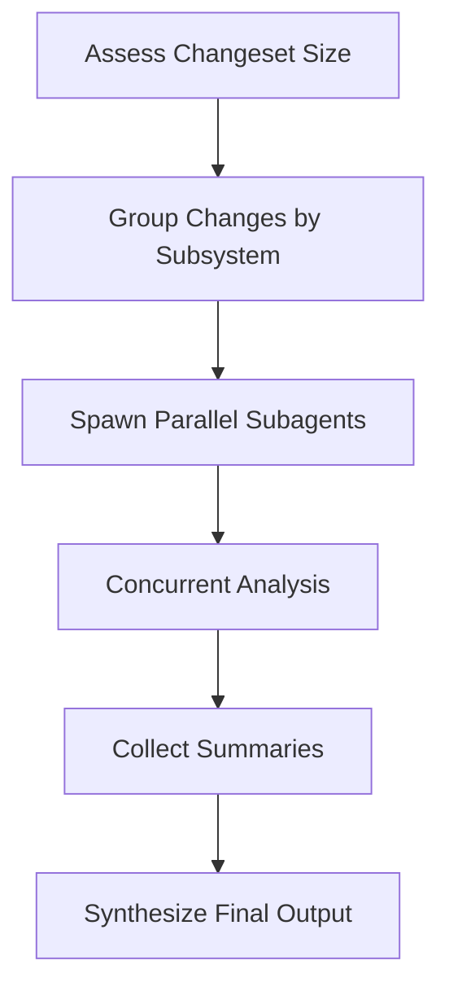

# Context Strategy

Git-Iris uses **adaptive context management** to handle changesets of any size — from single-line tweaks to massive refactors. The key is **relevance scoring**: intelligently prioritizing what Iris should focus on.

**Source:** `src/agents/tools/git.rs`, `src/agents/capabilities/*.toml`

## The Context Problem

### Token Limits Are Real

Even with large context windows (200K tokens), dumping entire changesets is problematic:

- **Cognitive overload** — LLMs struggle to synthesize 50+ files
- **Cost explosion** — Every token costs money
- **Latency increase** — Longer prompts = slower responses
- **Diluted attention** — Important changes get lost in noise

### The Solution: Adaptive Strategy

Git-Iris uses a **tiered approach** based on changeset size:

```
Small changeset       →  Full context for everything
Medium changeset      →  Relevance-based filtering
Large changeset       →  Top N files only
Very large changeset  →  Parallel subagent analysis
```

## Relevance Scoring Algorithm

Every changed file gets a **relevance score** (0.0 - 1.0) based on multiple factors:

### Scoring Factors

```rust
fn calculate_relevance_score(file: &StagedFile) -> (f32, Vec<&'static str>) {
    let mut score: f32 = 0.5;  // Base score
    let mut reasons = Vec::new();

    // Factor 1: Change Type
    match file.change_type {
        ChangeType::Added => {
            score += 0.15;
            reasons.push("new file");
        }
        ChangeType::Modified => {
            score += 0.1;
        }
        ChangeType::Deleted => {
            score += 0.05;
            reasons.push("deleted");
        }
    }

    // Factor 2: File Type
    if is_source_code(&file.path) {
        score += 0.15;
        reasons.push("source code");
    } else if is_config(&file.path) {
        score += 0.1;
        reasons.push("config");
    } else if is_docs(&file.path) {
        score += 0.02;
        reasons.push("docs");
    }

    // Factor 3: Path Patterns
    if file.path.contains("/src/") || file.path.starts_with("src/") {
        score += 0.1;
        reasons.push("core source");
    }
    if file.path.contains("/test") {
        score -= 0.1;
        reasons.push("test file");
    }
    if file.path.contains("generated") || file.path.contains(".lock") {
        score -= 0.2;
        reasons.push("generated/lock");
    }

    // Factor 4: Diff Size
    let diff_lines = file.diff.lines().count();
    if diff_lines > 10 && diff_lines < 200 {
        score += 0.1;
        reasons.push("substantive changes");
    } else if diff_lines >= 200 {
        score += 0.05;
        reasons.push("large diff");
    }

    // Factor 5: Semantic Changes
    let semantic_changes = detect_semantic_changes(&file.diff, &file.path);
    for change in semantic_changes {
        if change == "adds function" || change == "adds type" {
            score += 0.1;
        }
        reasons.push(change);
    }

    // Clamp to 0.0-1.0
    score.clamp(0.0, 1.0);
    (score, reasons)
}
```

### Semantic Change Detection

Beyond line counts, Git-Iris detects **structural changes**:

```rust
fn detect_semantic_changes(diff: &str, path: &str) -> Vec<&'static str> {
    let mut changes = Vec::new();
    let ext = get_extension(path);

    for line in diff.lines().filter(|l| l.starts_with('+')) {
        let line = line.trim_start_matches('+').trim();

        // Function definitions
        if is_function_def(line, ext) {
            changes.push("adds function");
        }

        // Type definitions
        if is_type_def(line, ext) {
            changes.push("adds type");
        }

        // Imports/dependencies
        if is_import(line, ext) {
            changes.push("modifies imports");
        }

        // Language-specific patterns
        if ext == "rs" && line.starts_with("impl ") {
            changes.push("adds impl");
        }
    }

    // Refactoring detection
    let has_deletions = diff.lines().any(|l| l.starts_with('-'));
    let has_additions = diff.lines().any(|l| l.starts_with('+'));

    if has_deletions && has_additions && changes.is_empty() {
        changes.push("refactors code");
    }

    changes
}
```

**Supported languages:**

- Rust: `pub fn`, `struct`, `enum`, `impl`, `use`
- TypeScript/JavaScript: `function`, `=>`, `class`, `interface`, `import`
- Python: `def`, `class`, `import`, `from`
- Go: `func`, `type`, `import`

### Example Scoring

```
src/agents/iris.rs
  + 0.5   base score
  + 0.1   modified (vs added)
  + 0.15  source code (.rs)
  + 0.1   core source (src/)
  + 0.1   substantive changes (87 lines)
  + 0.1   adds function
  + 0.1   adds impl
  ─────
  = 1.0   ★★★★★ (95% relevance)

tests/integration_test.rs
  + 0.5   base score
  + 0.1   modified
  + 0.15  source code (.rs)
  - 0.1   test file
  ─────
  = 0.65  ★★★ (65% relevance)

Cargo.lock
  + 0.5   base score
  + 0.1   modified
  - 0.2   lock file
  ─────
  = 0.4   ★★ (40% relevance)
```

## Size-Based Strategies

The `git_diff` tool includes size guidance in its output:

```rust
pub enum ChangesetSize {
    Small,      // ≤3 files, <100 lines total
    Medium,     // ≤10 files, <500 lines total
    Large,      // ≤20 files, <1000 lines total
    VeryLarge,  // >20 files or >1000 lines
}

impl ChangesetSize {
    fn from_stats(file_count: usize, total_lines: usize) -> Self {
        if file_count <= 3 && total_lines < 100 {
            Self::Small
        } else if file_count <= 10 && total_lines < 500 {
            Self::Medium
        } else if file_count <= 20 && total_lines < 1000 {
            Self::Large
        } else {
            Self::VeryLarge
        }
    }

    fn guidance(&self) -> &str {
        match self {
            Self::Small => "Consider all changes equally",
            Self::Medium => "Focus on files with >60% relevance (top 5-7 shown)",
            Self::Large => "Focus ONLY on top 5-7 highest-relevance files; summarize lower-relevance changes",
            Self::VeryLarge => "Consider using `parallel_analyze` to distribute analysis across subagents",
        }
    }
}
```

### Output Format

```
=== DIFF SUMMARY ===
Size: Medium (8 files, 347 lines changed)
Guidance: Focus on files with >60% relevance (top 5-7 shown)

=== CHANGES (sorted by relevance) ===

━━━━━━━━━━━━━━━━━━━━━━━━━━━━━━━━━━━━━━━━━━━━━━━━━━━━━━━━━━━━━━━━
📄 src/agents/iris.rs [MODIFIED] ★★★★★ 95% relevance
   Reasons: source code, core source, substantive changes, adds function
━━━━━━━━━━━━━━━━━━━━━━━━━━━━━━━━━━━━━━━━━━━━━━━━━━━━━━━━━━━━━━━━

@@ -310,6 +310,15 @@
 pub struct IrisAgent {
+    /// Fast model for subagents
+    fast_model: Option<String>,
}

━━━━━━━━━━━━━━━━━━━━━━━━━━━━━━━━━━━━━━━━━━━━━━━━━━━━━━━━━━━━━━━━
📄 src/agents/tools/parallel_analyze.rs [MODIFIED] ★★★★★ 92% relevance
   Reasons: source code, core source, adds function, adds type
━━━━━━━━━━━━━━━━━━━━━━━━━━━━━━━━━━━━━━━━━━━━━━━━━━━━━━━━━━━━━━━━

[diff content...]

━━━━━━━━━━━━━━━━━━━━━━━━━━━━━━━━━━━━━━━━━━━━━━━━━━━━━━━━━━━━━━━━
📄 Cargo.lock [MODIFIED] ★★ 40% relevance
   Reasons: generated/lock
━━━━━━━━━━━━━━━━━━━━━━━━━━━━━━━━━━━━━━━━━━━━━━━━━━━━━━━━━━━━━━━━

[omitted due to low relevance - 873 lines of dependency updates]
```

## Detail Levels

The `git_diff` tool supports three detail levels:

### 1. Summary

**Use case:** Quick overview, parallel analysis task planning

**Output:**

- File list with stats
- Relevance scores
- No diffs

```
=== DIFF SUMMARY ===
Size: Medium (8 files, 347 lines)

=== CHANGES (by relevance) ===
1. src/agents/iris.rs (95%) - source code, adds function
2. src/agents/tools/parallel_analyze.rs (92%) - source code, adds type
3. src/types/commit.rs (78%) - source code, new file
4. tests/integration_test.rs (65%) - test file
5. Cargo.toml (60%) - config
6. Cargo.lock (40%) - generated/lock
7. README.md (35%) - docs
8. .gitignore (20%) - config
```

### 2. Minimal

**Use case:** Medium changesets, focused analysis

**Output:**

- Files with relevance >60%
- Complete diffs for high-relevance files
- Truncated/omitted for low-relevance files

### 3. Full

**Use case:** Small changesets, comprehensive review

**Output:**

- All files with complete diffs
- Relevance scores (for Iris's reference)
- No truncation

## Capability-Specific Strategies

Capabilities guide Iris on using relevance scores:

### Commit Messages (`commit.toml`)

```toml
## Context Strategy by Size
- **Small** (≤3 files, <100 lines): Consider all changes equally
- **Medium** (≤10 files, <500 lines): Focus on files with >60% relevance
- **Large** (>10 files or >500 lines): Focus ONLY on top 5-7 highest-relevance files
- **Very Large** (>20 files or >1000 lines): Use `parallel_analyze`

Example:
```

parallel_analyze({
"tasks": [
"Summarize changes in src/api/",
"Summarize changes in src/models/",
"Summarize infrastructure changes"
]
})

```

```

### Code Reviews (`review.toml`)

```toml
## Analysis Strategy
1. Call `git_diff(detail="summary")` to understand changeset size
2. For Small/Medium: Use `git_diff(detail="full")`
3. For Large: Focus on high-relevance files, skim low-relevance
4. For Very Large: Use `parallel_analyze` to distribute review across subagents

Prioritize security and performance issues in high-relevance files.
```

### Pull Requests (`pr.toml`)

```toml
## Branch Analysis
1. Call `git_diff(from_ref="main", detail="summary")` for overview
2. Identify major themes (new features, refactors, fixes)
3. For large branches: Use `parallel_analyze` to analyze feature areas separately
4. Synthesize findings into a cohesive PR description

Include all breaking changes regardless of file relevance.
```

## Parallel Analysis

For very large changesets, Iris spawns **concurrent subagents**:

### When to Use

Automatically triggered for:

- **>20 files** changed
- **>1000 lines** changed
- **Batch operations** (multiple commits, release notes)

### How It Works



| Step              | Action                                | Example                                        |
| ----------------- | ------------------------------------- | ---------------------------------------------- |
| **1. Assess**     | Call `git_diff(detail="summary")`     | 47 files, 2,834 lines → "Use parallel_analyze" |
| **2. Group**      | Identify subsystems from file paths   | Auth: 12, API: 18, DB: 8, Config: 9 files      |
| **3. Spawn**      | Call `parallel_analyze` with tasks    | `["Analyze auth...", "Analyze API...", ...]`   |
| **4. Analyze**    | Subagents run concurrently            | Separate 4K token windows, core tool access    |
| **5. Collect**    | Each subagent returns focused summary | "Adds OAuth2...", "Three new endpoints..."     |
| **6. Synthesize** | Iris combines findings                | Unified commit message or PR description       |

### Benefits

- **No context overflow** — Each subagent works within token limits
- **Parallel execution** — 4 subagents finish in ~same time as 1
- **Focused analysis** — Each subagent examines its area deeply
- **Cost effective** — Uses fast model for bounded tasks

### Example Call

```rust
parallel_analyze({
    "tasks": [
        "Analyze security implications of authentication changes in src/auth/",
        "Review performance impact of database query refactors in src/db/",
        "Summarize API endpoint changes in src/api/",
        "Check for breaking changes in public interfaces"
    ]
})
```

Each task gets its own subagent with independent context.

## Progressive Deepening

Iris can **adaptively explore** based on initial findings:

```
1. Call git_diff(detail="summary")
   → See: "8 files, 347 lines, Medium changeset"
   → Strategy: Focus on >60% relevance

2. Call git_diff(detail="minimal")
   → Get: Top 5 files with diffs

3. Analyze top files
   → Notice: Major refactor in src/agents/iris.rs

4. Call file_read for context
   → Read: Surrounding code to understand refactor

5. Call code_search
   → Find: Related usages of refactored functions

6. Synthesize findings
   → Generate: Comprehensive commit message
```

This **breadth-first → depth-first** approach balances efficiency and thoroughness.

## Best Practices

### For Capability Authors

✅ **DO:**

- Include size-based guidance in prompts
- Suggest `parallel_analyze` for large changesets
- Instruct Iris to read guidance from `git_diff` output
- Allow adaptive strategies (summary → minimal → full)

❌ **DON'T:**

- Hardcode file thresholds
- Force full context for all sizes
- Ignore relevance scores
- Assume uniform file importance

### For Tool Designers

✅ **DO:**

- Surface relevance scores prominently
- Provide clear size categorization
- Include actionable guidance
- Sort by relevance automatically

❌ **DON'T:**

- Hide scoring methodology
- Return unsorted file lists
- Omit size/guidance information
- Use arbitrary cutoffs

### For Users

✅ **DO:**

- Trust Iris to focus on relevant changes
- Use `--debug` to see relevance reasoning
- Review low-relevance files manually if needed
- Adjust `.gitignore` for generated files

❌ **DON'T:**

- Commit lock files or generated code
- Stage unrelated changes
- Expect Iris to read every line of massive diffs

## Testing Relevance Scoring

### Unit Tests

```rust
#[test]
fn scores_source_code_higher_than_docs() {
    let source = StagedFile {
        path: "src/main.rs".to_string(),
        change_type: ChangeType::Modified,
        diff: "...",
    };

    let docs = StagedFile {
        path: "README.md".to_string(),
        change_type: ChangeType::Modified,
        diff: "...",
    };

    let (source_score, _) = calculate_relevance_score(&source);
    let (docs_score, _) = calculate_relevance_score(&docs);

    assert!(source_score > docs_score);
}
```

### Integration Tests

```rust
#[tokio::test]
async fn handles_large_changeset() {
    // Create a repo with 25 changed files
    let repo = setup_large_test_repo();

    let tool = GitDiff;
    let result = tool.call(GitDiffArgs {
        detail: DetailLevel::Summary,
        from_ref: None,
        to_ref: None,
    }).await.unwrap();

    assert!(result.contains("Very Large"));
    assert!(result.contains("parallel_analyze"));
}
```

## Debug Output

Enable `--debug` to see relevance calculation:

```
🔵 Calculating relevance scores...
   src/agents/iris.rs:
     + 0.1  modified
     + 0.15 source code
     + 0.1  core source
     + 0.1  substantive changes (87 lines)
     + 0.1  adds function
     + 0.1  adds impl
     ─────
     = 0.95 ★★★★★

   Cargo.lock:
     + 0.1  modified
     - 0.2  lock file
     ─────
     = 0.4  ★★
```

## Future Improvements

Potential enhancements to relevance scoring:

1. **Dependency analysis** — Files that import changed modules get higher scores
2. **Git history** — Files changed frequently together are grouped
3. **User feedback** — Learn from user edits to commit messages
4. **Project-specific weights** — Allow `.git-iris.toml` to customize scoring
5. **Diff entropy** — Measure information density, not just line count

## Next Steps

- [Agent System](./agent.md) — How Iris uses context in execution
- [Tools](./tools.md) — Implementation of `git_diff` and scoring
- [Capabilities](./capabilities.md) — How prompts guide context strategy
