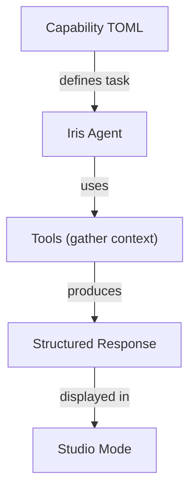

# Extending Git-Iris

Git-Iris is built to be extensible. You can add new capabilities, tools, and Studio modes to enhance Iris's intelligence and expand what she can do.

## Extension Points

Git-Iris offers three primary extension mechanisms:

### 1. **Capabilities** → What Iris Can Do

Add new tasks Iris can perform (like "generate commit message" or "review code"). Capabilities are defined in TOML files with prompts and output schemas.

**→ [Adding Capabilities](./capabilities.md)**

### 2. **Tools** → How Iris Gathers Context

Give Iris new ways to inspect your codebase and gather information. Tools are Rust implementations using the Rig framework's `Tool` trait.

**→ [Adding Tools](./tools.md)**

### 3. **Studio Modes** → How Users Interact

Create new interactive TUI modes in Iris Studio for specific workflows. Modes combine state management, event handling, and rendering.

**→ [Adding Studio Modes](./modes.md)**

## Architecture Overview



### How Extensions Work Together

**Example: Code Review Capability**

1. **Capability TOML** (`review.toml`) defines the review task prompt and output format
2. **Tools** (`git_diff`, `file_analyzer`, `code_search`) provide Iris with code context
3. **Output Type** (`MarkdownReview`) structures the review content
4. **Studio Mode** (Review mode) displays the review with panels for file list, diff, and output

## Quick Start

### Adding a Simple Capability

1. Create `src/agents/capabilities/my_capability.toml`
2. Define the prompt and output type
3. Add output type to `StructuredResponse` enum
4. Register in capability loader

**Time: ~30 minutes**

### Adding a Tool

1. Create `src/agents/tools/my_tool.rs`
2. Implement the `Tool` trait
3. Register in tool registry
4. Test with debug mode

**Time: ~1 hour**

### Adding a Studio Mode

1. Add mode variant to `Mode` enum
2. Create state struct in `src/studio/state/modes.rs`
3. Implement handler in `src/studio/handlers/`
4. Implement renderer in `src/studio/render/`

**Time: ~2-4 hours**

## Development Workflow

```bash
# Build with your changes
cargo build

# Test a capability
cargo run -- gen --debug

# Test in Studio
cargo run -- studio

# Run tests
cargo test

# Lint
cargo clippy
```

## Key Design Principles

### 1. LLM-First Architecture

The LLM makes intelligent decisions—avoid hardcoded heuristics. Let Iris explore and reason using tools rather than dumping all context upfront.

### 2. Tool-Based Context Gathering

Tools should be focused and composable. Each tool does one thing well. Iris orchestrates them.

### 3. Pure Reducer Pattern (Studio)

State transitions are pure functions: `(state, event) → (state, effects)`. Side effects are data, not execution.

### 4. Structured Output

Use JSON schemas for parseable responses. Provide clear examples in prompts.

## Code Organization

```
src/
├── agents/
│   ├── capabilities/      # Task definitions (TOML)
│   ├── tools/             # Context gathering (Rust)
│   └── iris.rs            # Main agent implementation
├── studio/
│   ├── state/            # Mode state definitions
│   ├── handlers/         # Input handling
│   ├── render/           # UI rendering
│   └── components/       # Reusable UI components
├── types/                # Output type definitions
└── services/             # Pure operations (no LLM)
```

## Real-World Examples

Throughout the extension guides, we reference real implementations from the codebase:

- **Commit Capability**: `src/agents/capabilities/commit.toml`
- **Git Tools**: `src/agents/tools/git.rs`
- **Commit Mode**: `src/studio/state/modes.rs` → `CommitMode`
- **File Analyzer**: `src/agents/tools/file_analyzer.rs`
- **Review Mode**: Complete mode with state, handler, and renderer

## Contributing

Ready to contribute your extension back to Git-Iris? Check out the [Contributing Guide](./contributing.md) for development setup, testing requirements, and PR guidelines.

## Need Help?

- Read the [Architecture Documentation](/architecture/) for system design details
- Check existing capabilities and tools for patterns
- Open an issue on GitHub with questions
- Join the community discussions

**Let's build something powerful.** ⚡
