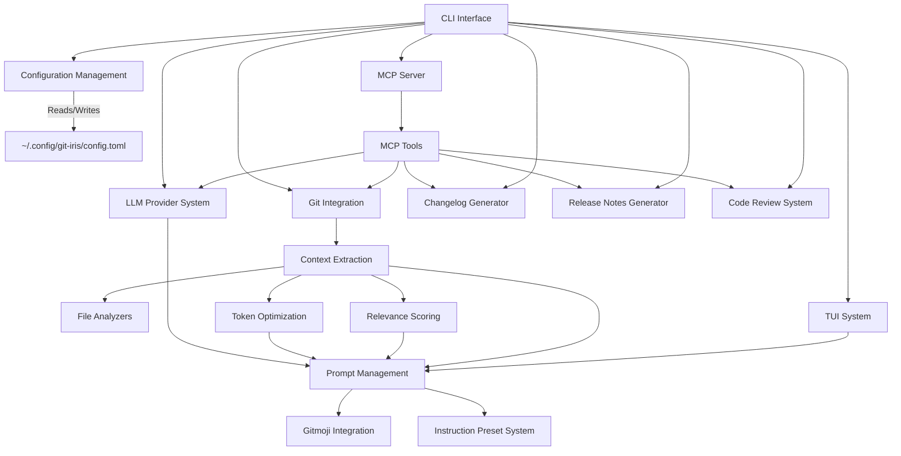

# Git-Iris Architecture Design

## 1. High-Level Overview

Git-Iris is a Rust-based command-line tool that leverages AI to enhance Git workflows. The application integrates with Git repositories, analyzes code changes, and uses Large Language Models (LLMs) to produce context-aware commit messages, code reviews, changelogs, and release notes.

## 2. Core Components

### 2.1 CLI Interface

- Handles user input and output using `clap` for argument parsing
- Implements command pattern for operations (generate, config, review, changelog, etc.)
- Provides colored output and status indicators during processing

### 2.2 Git Integration

- Interfaces with Git repositories using the `git2` library
- Retrieves relevant Git information (diff, branch name, recent commits)
- Supports local and remote repositories with optimized content extraction
- Handles commit operations with hooks and verification

### 2.3 LLM Provider System

- Leverages the [llm crate](https://crates.io/crates/llm) for multiple AI provider support
- Supports major providers: OpenAI, Anthropic, Google, Ollama, XAI, DeepSeek, Phind, Groq
- Handles API authentication, rate limiting, and token optimization
- Implements backward compatibility for legacy provider names
- Manages provider-specific configurations and model selection

### 2.4 Context Extraction

- Analyzes Git diffs and repository structure
- Extracts relevant information for LLM prompt generation
- Implements language-specific analyzers for improved context
- Uses relevance scoring to prioritize information

### 2.5 Prompt Management

- Constructs prompts for LLMs based on extracted context and user preferences
- Manages system prompts and user-defined custom instructions
- Supports instruction presets for different use cases and output styles

### 2.6 Token Optimization

- Ensures prompts fit within token limits of LLM providers
- Implements intelligent truncation strategies to maximize relevant information
- Preserves high-priority information during optimization

### 2.7 Configuration Management

- Handles user configuration (API keys, preferences, custom instructions)
- Manages provider-specific settings including models and parameters
- Uses `~/.config/git-iris/config.toml` as the global configuration location
- Supports project-specific configuration for repository-level settings

### 2.8 Gitmoji Integration

- Provides optional Gitmoji support for commit messages
- Manages Gitmoji mappings and integration logic
- Allows AI to select appropriate emojis based on commit content

### 2.9 File Analyzers

- Implements language-specific analyzers for various file types (20+ supported)
- Extracts relevant information from changed files to provide better context
- Identifies modified functions, classes, methods, and structures
- Recognizes project metadata such as dependencies and versions

### 2.10 Relevance Scoring

- Implements a scoring system to determine the relevance of changes
- Helps prioritize information for inclusion in the context
- Uses file type and change type as scoring factors

### 2.11 Changelog Generator

- Analyzes commit history between specified Git references
- Generates structured changelogs based on commit messages and code changes
- Supports different detail levels and customization options
- Uses LLM to categorize and summarize changes

### 2.12 Release Notes Generator

- Builds upon the Changelog Generator to create comprehensive release notes
- Incorporates additional context and summaries for release documentation
- Supports customization through presets and user instructions
- Includes highlights, breaking changes, and upgrade notes

### 2.13 Instruction Preset System

- Manages predefined sets of instructions for different commit styles and documentation formats
- Allows users to quickly switch between different documentation styles
- Supports separate presets for commits, reviews, and documentation

### 2.14 Code Review System

- Analyzes staged or committed changes for quality assessment
- Evaluates code across multiple dimensions (complexity, security, performance, etc.)
- Provides actionable feedback with specific recommendations
- Formats output for readability with issue severity classification

### 2.15 Text User Interface (TUI)

- Provides an interactive terminal interface for commit message generation
- Allows users to navigate, edit, and regenerate messages
- Supports custom instructions and emoji selection
- Uses crossterm and ratatui for cross-platform rendering

### 2.16 Model Context Protocol (MCP) Integration

- Implements an MCP server to expose Git-Iris functionality to AI assistants and editors
- Supports both stdio and SSE transport protocols
- Exposes tools for commit generation, code review, changelog, and release notes
- Allows AI assistants to directly interact with Git repositories

## 3. Data Flow

1. User invokes Git-Iris via CLI or an MCP client
2. CLI Interface parses input and retrieves configuration
3. Git Integration extracts repository information
4. Context Extraction analyzes changes and builds context
5. File Analyzers process changed files and extract relevant information
6. Relevance Scoring prioritizes the extracted information
7. Token Optimization ensures context fits within limits
8. Prompt Management constructs the full prompt
9. LLM Provider System sends the prompt to the selected LLM API
10. Processing based on command:

- For commit messages: Interactive TUI allows user refinement
- For code reviews: Results are formatted and displayed
- For changelogs and release notes: Content is displayed or saved to file

11. Git Integration applies the final commit (if confirmed for commit messages)

## 4. Key Design Patterns and Principles

### 4.1 Plugin Architecture for LLM Providers

- Allows easy addition of new LLM providers
- Uses trait-based polymorphism for provider implementations

### 4.2 Command Pattern for CLI Operations

- Encapsulates each major operation (generate, config, review) as a command object
- Facilitates easy addition of new CLI commands

### 4.3 Strategy Pattern for File Analyzers

- Enables language-specific analysis of changed files
- Allows for easy extension to support new file types

### 4.4 Factory Method for Provider Creation

- Centralizes provider instance creation
- Simplifies the process of adding new providers

### 4.5 Dependency Injection

- Uses dependency injection for better testability and flexibility
- Allows easy swapping of components (e.g., for testing)

### 4.6 Builder Pattern for Configuration

- Provides fluent interface for configuration building
- Makes configuration updates more readable and maintainable

## 5. Error Handling and Logging

- Utilizes `anyhow` for flexible error handling
- Implements a custom logging system with optional file output
- Provides verbose mode for detailed debugging information
- Uses context-aware error messages to help users resolve issues

## 6. Configuration Management

- Uses TOML for the configuration file format
- Stores configuration in `~/.config/git-iris/config.toml`
- Implements a command-line interface for easy configuration updates
- Supports project-specific configuration for repository-level settings

## 7. Testing Strategy

- Unit tests for individual components
- Integration tests for end-to-end workflows
- Mock LLM providers for testing without API calls
- Property-based testing for complex components (e.g., token optimization)

## 8. Performance Considerations

- Efficient token counting and optimization
- Caching of repeated operations (e.g., file analysis results)
- Asynchronous API calls to improve responsiveness
- Smart file content extraction to minimize unnecessary processing

## 9. Security Considerations

- Secure storage of API keys in the configuration file
- No transmission of sensitive data beyond necessary API calls
- Clear guidelines for users on API key management
- Option to use local LLM providers like Ollama for sensitive environments

## 10. Extensibility

The architecture is designed for easy extension in several areas:

- Adding new LLM providers
- Implementing new file type analyzers
- Extending CLI commands
- Adding new configuration options
- Creating new instruction presets
- Supporting additional MCP tools

## 11. MCP Integration

The MCP (Model Context Protocol) integration allows Git-Iris to be used directly from AI assistants and editors:

- Implements an MCP server that exposes Git-Iris functionality
- Supports both stdio and SSE transport protocols
- Provides tools for commit generation, code review, changelog, and release notes
- Enables AI assistants to interact with Git repositories directly
- Facilitates usage from Claude Desktop, Cursor, VS Code, and other MCP clients

## 12. Component Diagram

## 13. LLM Provider System

The LLM Provider System integrates with the external [llm crate](https://crates.io/crates/llm) to support multiple AI providers:

- Provides a unified interface to various LLM providers:
  - OpenAI (gpt-4o)
  - Anthropic (claude-3-7-sonnet-20250219)
  - Google (gemini-2.0-flash)
  - Ollama (llama3)
  - XAI (grok-2-beta)
  - DeepSeek (deepseek-chat)
  - Phind (phind-v2)
  - Groq (llama-3.1-70b-versatile)
- Manages provider-specific configurations (API keys, models, token limits)
- Implements backward compatibility (e.g., "claude" → "anthropic")
- Handles error recovery and request optimization

## 14. File Analyzer System

The File Analyzer System allows for language-specific analysis of changed files:

- Implements a `FileAnalyzer` trait for all file type analyzers
- Supports 20+ languages and file types including:
  - Rust, JavaScript/TypeScript, Python, Java, C/C++, Kotlin
  - JSON, YAML, TOML, Markdown
  - Build files (Gradle, Maven, Cargo)
  - Configuration files and more
- Extracts relevant information such as modified functions, classes, and structures
- Provides context for more accurate AI-generated content

## 15. Token Optimization

The Token Optimization system ensures that the context provided to LLMs fits within token limits:

- Implements intelligent truncation strategies based on priority
- Allocates tokens to diffs (highest), commits (medium), and file contents (lowest)
- Ensures the most important context is preserved within token limits
- Uses tiktoken-rs for accurate token counting

## 16. Interactive Commit Process

The Interactive Commit Process provides a user-friendly interface for reviewing and refining commit messages:

- Allows navigation through multiple generated messages
- Provides options for editing messages and regenerating with new instructions
- Supports emoji selection and custom instructions
- Implements a visually appealing TUI interface with color coding and formatting

## 17. Code Review System

The Code Review System provides in-depth analysis of code changes:

- Evaluates code across 11 quality dimensions:
  - Complexity, Abstraction, Deletion, Hallucination, Style
  - Security, Performance, Duplication, Error Handling
  - Testing, Best Practices
- Identifies specific issues with severity ratings
- Provides actionable recommendations for improvement
- Highlights positive aspects of the code changes
- Formats output for readability and easy navigation

## 18. Changelog Generation System

The Changelog Generation system creates structured changelogs based on Git history:

- Analyzes commits between specified Git references
- Categorizes changes into sections (Added, Changed, Deprecated, etc.)
- Extracts breaking changes and provides detailed descriptions
- Includes metrics on files changed, insertions, and deletions
- Supports different levels of detail (minimal, standard, detailed)

## 19. Release Notes Generation System

The Release Notes Generation system creates comprehensive release documentation:

- Incorporates changelog information
- Adds high-level summaries and overviews of changes
- Includes highlighted features and improvements
- Documents breaking changes and upgrade notes
- Uses LLM to generate user-friendly content

## 20. Model Context Protocol Integration

The MCP Integration allows Git-Iris to be used directly from AI assistants and editors:

- Implements the Model Context Protocol specification
- Exposes Git-Iris functionality through standardized tools
- Supports both stdio and SSE transport protocols
- Enables usage from Claude Desktop, Cursor, VS Code, and other MCP clients
- Provides secure authentication and parameter validation
