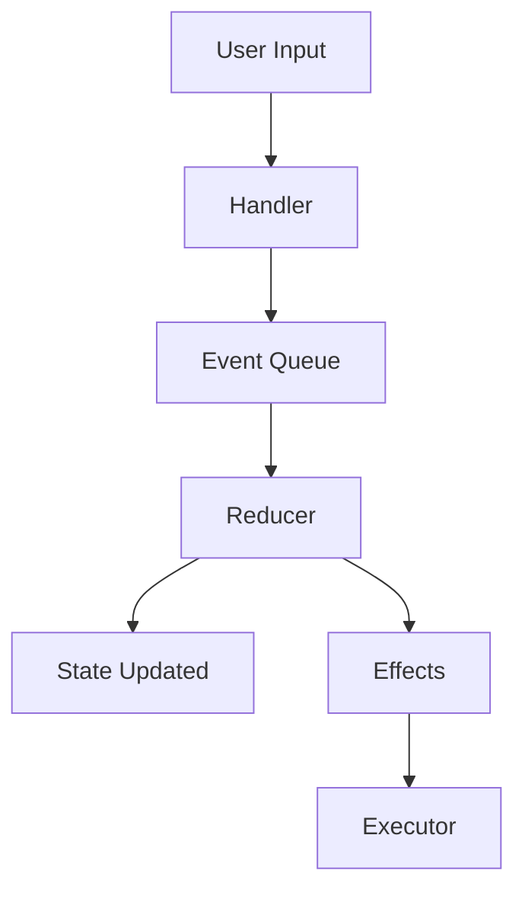
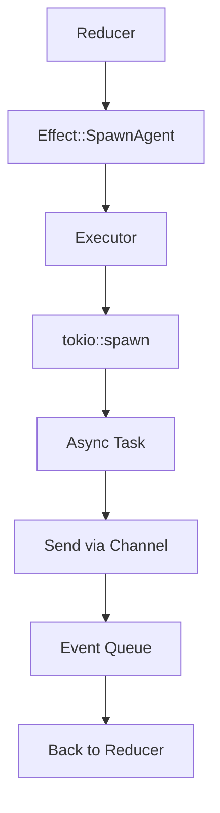

# Event System

**Complete guide to Iris Studio's event-driven architecture.**

## Philosophy

**All state changes are events.** Every interaction, every LLM response, every git operation — all represented as data flowing through a single event system.

## Why Events?

Traditional imperative code scatters logic everywhere:

```rust
// BAD: Logic in multiple places
fn handle_key(&mut self, key: Key) {
    if key == 'g' {
        self.state.generating = true;
        self.spawn_agent();
        self.ui.show_spinner();
    }
}

fn on_agent_complete(&mut self, result: Result) {
    self.state.generating = false;
    self.ui.hide_spinner();
    self.state.message = result;
}
```

**Problems:**

- State mutations in many places
- Hard to trace "what happened?"
- Difficult to test
- No audit trail

With events, everything flows through one system:

```rust
// GOOD: Central event flow
pub enum Event {
    GenerateCommit,
    AgentComplete { result },
}

fn reduce(state: &mut State, event: Event) -> Vec<Effect> {
    match event {
        Event::GenerateCommit => {
            state.generating = true;
            vec![Effect::SpawnAgent]
        }
        Event::AgentComplete { result } => {
            state.generating = false;
            state.message = result;
            vec![]
        }
    }
}
```

**Benefits:**

- Single source of truth
- Complete audit trail
- Easy testing
- Replay-able

## Event Types

Located in `src/studio/events.rs`:

```rust
pub enum StudioEvent {
    // User Input
    KeyPressed(KeyEvent),
    Mouse(MouseEvent),

    // Navigation
    SwitchMode(Mode),
    FocusPanel(PanelId),
    FocusNext,
    FocusPrev,

    // Content Generation
    GenerateCommit { instructions, preset, use_gitmoji },
    GenerateReview { from_ref, to_ref },
    GeneratePR { base_branch, to_ref },
    GenerateChangelog { from_ref, to_ref },
    GenerateReleaseNotes { from_ref, to_ref },
    ChatMessage(String),

    // Agent Responses
    AgentStarted { task_type },
    AgentProgress { task_type, tool_name, message },
    AgentComplete { task_type, result },
    AgentError { task_type, error },
    StreamingChunk { task_type, chunk, aggregated },
    StreamingComplete { task_type },

    // Tool-Triggered (agent controls UI)
    UpdateContent { content_type, content },
    LoadData { data_type, from_ref, to_ref },
    StageFile(PathBuf),
    UnstageFile(PathBuf),

    // File & Git
    FileStaged(PathBuf),
    FileUnstaged(PathBuf),
    RefreshGitStatus,
    GitStatusRefreshed,
    SelectFile(PathBuf),

    // Modals
    OpenModal(ModalType),
    CloseModal,
    ModalConfirmed { modal_type, data },

    // UI Updates
    Notify { level, message },
    Scroll { direction, amount },
    ToggleEditMode,
    NextMessageVariant,
    PrevMessageVariant,
    CopyToClipboard(String),

    // Settings
    SetPreset(String),
    ToggleGitmoji,
    SetEmoji(String),

    // Lifecycle
    Quit,
    Tick,
}
```

**30+ event variants** covering every possible state transition.

## Event Categories

### User Input Events

**Origin:** Keyboard, mouse

```rust
KeyPressed(KeyEvent)    // Filtered for Press kind only
Mouse(MouseEvent)       // Click, scroll, drag
```

**Flow:**

1. Crossterm captures raw input
2. Event loop filters/normalizes
3. Dispatches as `StudioEvent`
4. Handler maps to semantic events

**Example:**

```
User presses 'g' in Commit mode
  ↓
KeyPressed(KeyEvent { code: Char('g'), ... })
  ↓
Handler: handle_commit_key()
  ↓
GenerateCommit { instructions: None, preset: "default", use_gitmoji: true }
```

### Navigation Events

**Origin:** User input, mode switching

```rust
SwitchMode(Mode)        // Change to different mode
FocusPanel(PanelId)     // Focus specific panel
FocusNext               // Tab to next panel
FocusPrev               // Shift-Tab to previous
```

**Effects:**

- Update `active_mode` or `focused_panel`
- May trigger `LoadData` for new mode
- Updates UI rendering

### Content Generation Events

**Origin:** User requests Iris to generate content

```rust
GenerateCommit { instructions, preset, use_gitmoji }
GenerateReview { from_ref, to_ref }
GeneratePR { base_branch, to_ref }
GenerateChangelog { from_ref, to_ref }
GenerateReleaseNotes { from_ref, to_ref }
ChatMessage(String)
```

**Flow:**

```
User triggers generation
  ↓
GenerateCommit event
  ↓
Reducer sets generating=true
  ↓
Returns SpawnAgent effect
  ↓
Executor spawns async task
  ↓
Task runs LLM API call
  ↓
Task sends AgentComplete event
  ↓
Reducer updates state with result
```

### Agent Response Events

**Origin:** Async agent tasks

```rust
AgentStarted { task_type }
AgentProgress { task_type, tool_name, message }
AgentComplete { task_type, result }
AgentError { task_type, error }
StreamingChunk { task_type, chunk, aggregated }
StreamingComplete { task_type }
```

**Lifecycle:**

```
AgentStarted
  ↓
AgentProgress (tool: git_diff)
  ↓
AgentProgress (tool: git_log)
  ↓
StreamingChunk ("feat")
  ↓
StreamingChunk ("feat: add")
  ↓
StreamingChunk ("feat: add user auth")
  ↓
StreamingComplete
  ↓
AgentComplete { result }
```

**Why separate events?**

- UI can show progress ("Using tool: git_diff")
- Streaming updates provide real-time feedback
- Errors can be handled gracefully

### Tool-Triggered Events

**Origin:** Agent tool calls (Iris controls UI)

```rust
UpdateContent { content_type, content }
LoadData { data_type, from_ref, to_ref }
StageFile(PathBuf)
UnstageFile(PathBuf)
```

**Example:** Iris can update commit message via chat:

```
User: "Make it more concise"
  ↓
ChatMessage("Make it more concise")
  ↓
Agent uses update_commit_message tool
  ↓
Tool emits UpdateContent { content_type: CommitMessage, content: ... }
  ↓
Reducer updates state.modes.commit.message
  ↓
UI shows updated message
```

**Why?** Agent can manipulate UI state through tools. Powerful for chat interactions.

### Git & File Events

**Origin:** Git operations, file selection

```rust
StageFile(PathBuf)         // Request to stage
FileStaged(PathBuf)        // Successfully staged
UnstageFile(PathBuf)       // Request to unstage
FileUnstaged(PathBuf)      // Successfully unstaged
RefreshGitStatus           // Request refresh
GitStatusRefreshed         // Refresh complete
SelectFile(PathBuf)        // User selects file in tree
```

**Pattern: Request/Response**

```
User clicks file in tree
  ↓
SelectFile(path)
  ↓
Reducer updates selected_file
  ↓
Returns LoadData { data_type: FileContent }
  ↓
Executor loads file async
  ↓
Sends DataLoaded event
  ↓
Reducer updates code_view state
```

### Modal Events

**Origin:** User opens/closes dialogs

```rust
OpenModal(ModalType)
CloseModal
ModalConfirmed { modal_type, data }
```

**Modal Types:**

```rust
pub enum ModalType {
    Help,
    Chat,
    Settings,
    PresetSelector,
    EmojiSelector,
    RefSelector { field },
    ConfirmCommit,
    ConfirmQuit,
}
```

**Flow:**

```
User presses '?'
  ↓
OpenModal(Help)
  ↓
state.modal = Some(Modal::Help)
  ↓
Render shows help overlay
  ↓
User presses Esc
  ↓
CloseModal
  ↓
state.modal = None
```

### UI Update Events

**Origin:** User interactions, state changes

```rust
Notify { level, message }        // Show notification
Scroll { direction, amount }     // Scroll content
ToggleEditMode                   // View ↔ Edit
NextMessageVariant               // Cycle messages
PrevMessageVariant
CopyToClipboard(String)
```

### Lifecycle Events

**Origin:** Timer, shutdown

```rust
Tick    // Animation frame (~250ms)
Quit    // User requests exit
```

**Tick events:**

- Advance spinner animation
- Clean up expired notifications
- Update timestamps
- Poll async channels

## Event Flow

### Synchronous Flow



**Flow:** User input → Handler maps to event → Queue → Reducer processes → State updates + Effects returned → Executor runs effects

### Asynchronous Flow



**Flow:** Reducer emits effect → Executor spawns async task → Task runs (LLM call, git op) → Result sent via channel → Event queue → Back to reducer

**Key insight:** Async work happens **outside** reducer, results come back as events.

## Event Sources

Events come from three sources:

```rust
pub enum EventSource {
    User,    // Keyboard, mouse
    Agent,   // LLM responses
    Tool,    // Agent tool calls
    System,  // Tick, refresh
}
```

Tracked in history:

```rust
pub struct TimestampedEvent {
    pub timestamp: Instant,
    pub source: EventSource,
    pub event: StudioEvent,
}
```

**Why track source?**

- Debugging ("was this user or agent?")
- Analytics (how often do users vs agents trigger actions?)
- Replay (filter events by source)

## Supporting Types

### TaskType

```rust
pub enum TaskType {
    Commit,
    Review,
    PR,
    Changelog,
    ReleaseNotes,
    Chat,
    SemanticBlame,
}
```

Identifies which agent task is running. Used in:

- `AgentStarted { task_type }`
- `AgentComplete { task_type, result }`
- Progress tracking

### AgentResult

```rust
pub enum AgentResult {
    CommitMessages(Vec<GeneratedMessage>),
    ReviewContent(String),
    PRContent(String),
    ChangelogContent(String),
    ReleaseNotesContent(String),
    ChatResponse(String),
    SemanticBlame(SemanticBlameResult),
}
```

Typed result from agent completion. Reducer matches on this to update correct state field.

### ContentType

```rust
pub enum ContentType {
    CommitMessage,
    PRDescription,
    CodeReview,
    Changelog,
    ReleaseNotes,
}
```

Used in `UpdateContent` events when agent tools update UI state.

### ContentPayload

```rust
pub enum ContentPayload {
    Commit(GeneratedMessage),
    Markdown(String),
}
```

Data for content updates. Structured (commit) vs unstructured (markdown).

### DataType

```rust
pub enum DataType {
    GitStatus,
    CommitDiff,
    ReviewDiff,
    PRDiff,
    ChangelogCommits,
    ReleaseNotesCommits,
}
```

Identifies what data to load asynchronously.

### NotificationLevel

```rust
pub enum NotificationLevel {
    Info,
    Success,
    Warning,
    Error,
}
```

Determines notification color/icon.

### ScrollDirection

```rust
pub enum ScrollDirection {
    Up,
    Down,
    PageUp,
    PageDown,
    Top,
    Bottom,
}
```

Semantic scroll commands (not raw line offsets).

## Side Effects

**Effects are data** describing I/O operations to execute after state update:

```rust
pub enum SideEffect {
    SpawnAgent { task: AgentTask },
    LoadData { data_type, from_ref, to_ref },
    GitStage(PathBuf),
    GitUnstage(PathBuf),
    GitStageAll,
    GitUnstageAll,
    SaveSettings,
    RefreshGitStatus,
    CopyToClipboard(String),
    ExecuteCommit { message },
    Quit,
}
```

**Why separate from events?**

- Events describe **what happened**
- Effects describe **what to do**

Reducer returns effects, executor performs I/O.

### AgentTask

```rust
pub enum AgentTask {
    Commit { instructions, preset, use_gitmoji },
    Review { from_ref, to_ref },
    PR { base_branch, to_ref },
    Changelog { from_ref, to_ref },
    ReleaseNotes { from_ref, to_ref },
    Chat { message, context },
    SemanticBlame { blame_info },
}
```

Describes agent work to spawn.

### ChatContext

```rust
pub struct ChatContext {
    pub mode: Mode,
    pub current_content: Option<String>,
    pub diff_summary: Option<String>,
}
```

Provides context to chat agent about current mode and content.

## Event Lifecycle Example

Let's trace a complete flow: **User generates commit message**

```
1. User presses 'g' in Commit mode
   ↓
2. Event loop captures KeyEvent { code: Char('g') }
   ↓
3. Dispatcher calls handle_commit_key(state, key)
   ↓
4. Handler checks: no modal, not editing, key is 'g'
   Returns: []  (effects handled by reducer directly)
   Actually pushes event to queue:
   GenerateCommit { instructions: None, preset: "default", use_gitmoji: true }
   ↓
5. Event loop processes queue
   ↓
6. Calls reduce(state, event, history)
   ↓
7. Reducer matches GenerateCommit:
   - state.modes.commit.generating = true
   - state.set_iris_thinking("Generating commit message...")
   - history.record_agent_start(TaskType::Commit)
   Returns: [SpawnAgent { task: Commit { ... } }]
   ↓
8. Executor receives effects
   ↓
9. Matches SpawnAgent, spawns async task:
   tokio::spawn(async {
       let result = agent.generate_commit(...).await;
       tx.send(AgentComplete { task_type: Commit, result });
   })
   ↓
10. UI renders with generating=true, shows spinner
    ↓
11. Agent task runs (calls LLM API)
    ↓
12. Agent sends progress events:
    AgentProgress { task_type: Commit, tool_name: "git_diff", message: "..." }
    ↓
13. Reducer updates status: "Using git_diff..."
    ↓
14. Agent completes, sends event:
    AgentComplete { task_type: Commit, result: CommitMessages([...]) }
    ↓
15. Event loop receives from channel
    ↓
16. Calls reduce(state, event, history)
    ↓
17. Reducer matches AgentComplete:
    - state.modes.commit.messages = result
    - state.modes.commit.generating = false
    - state.iris_status = Idle
    - history.record_agent_complete(Commit, true)
    - history.record_commit_message(&messages[0])
    Returns: []
    ↓
18. UI renders with new messages, no spinner
```

**Notice:**

- Clear request/response pattern
- State updates are synchronous
- Async work happens outside reducer
- All changes recorded to history

## Event Patterns

### Pattern 1: User Action

```rust
// User triggers action
KeyPressed(key)
  ↓ (handler)
GenerateCommit { ... }
  ↓ (reducer)
State updated, SpawnAgent effect returned
  ↓ (executor)
Async task spawned
```

### Pattern 2: Request/Response

```rust
// User requests data
RefreshGitStatus
  ↓ (reducer)
State: loading=true, Effect: RefreshGitStatus
  ↓ (executor)
Async git status load
  ↓
GitStatusRefreshed event sent
  ↓ (reducer)
State updated with new git status
```

### Pattern 3: Agent Tool Call

```rust
// Agent uses tool to update UI
Chat: "Make commit message shorter"
  ↓
ChatMessage event
  ↓ (reducer)
SpawnAgent { task: Chat }
  ↓
Agent calls update_commit_message tool
  ↓
Tool emits UpdateContent event
  ↓ (reducer)
State.modes.commit.message updated
```

### Pattern 4: Optimistic Update

```rust
// Assume success, rollback on error
StageFile(path)
  ↓ (reducer)
State: staged_files.push(path), Effect: GitStage(path)
  ↓ (executor)
Git add command
  ↓
If success: FileStaged(path)
If error: FileStageFailed(path)
  ↓ (reducer)
FileStageFailed: rollback staged_files
```

## History and Replay

Every event is recorded to history:

```rust
pub struct History {
    pub events: Vec<TimestampedEvent>,
    pub mode_history: Vec<ModeSwitch>,
    pub content_history: Vec<ContentSnapshot>,
    pub chat_messages: Vec<ChatMessage>,
}
```

**Use cases:**

### Debugging

```rust
// Print all events leading to current state
for event in &history.events {
    println!("{:?} from {:?} at {:?}",
        event.event, event.source, event.timestamp);
}
```

### Session Persistence

```rust
// Save session
history.save_to_file("session.json")?;

// Restore session
let history = History::load_from_file("session.json")?;
// Replay events to reconstruct state
for event in history.events {
    reduce(&mut state, event.event, &mut new_history);
}
```

### Analytics

```rust
// How often do users generate commits?
let commit_count = history.events.iter()
    .filter(|e| matches!(e.event, StudioEvent::GenerateCommit { .. }))
    .count();

// Average time between mode switches?
let switches: Vec<_> = history.events.iter()
    .filter(|e| matches!(e.event, StudioEvent::SwitchMode(_)))
    .collect();
```

### Replay for Testing

```rust
#[test]
fn test_session_replay() {
    let mut state = StudioState::new(config, None);
    let mut history = History::new();

    // Simulate user session
    let events = vec![
        StudioEvent::SwitchMode(Mode::Commit),
        StudioEvent::GenerateCommit { ... },
        StudioEvent::AgentComplete { ... },
    ];

    for event in events {
        reduce(&mut state, event, &mut history);
    }

    assert_eq!(state.active_mode, Mode::Commit);
    assert!(!state.modes.commit.messages.is_empty());
}
```

## Testing Events

Events are data, easy to test:

```rust
#[test]
fn test_event_serialization() {
    let event = StudioEvent::GenerateCommit {
        instructions: Some("Be concise".into()),
        preset: "default".into(),
        use_gitmoji: true,
    };

    let json = serde_json::to_string(&event).unwrap();
    let parsed: StudioEvent = serde_json::from_str(&json).unwrap();

    assert_eq!(event, parsed);
}

#[test]
fn test_event_ordering() {
    let mut history = History::new();

    history.record_event(EventSource::User, StudioEvent::SwitchMode(Mode::Commit));
    history.record_event(EventSource::User, StudioEvent::GenerateCommit { ... });
    history.record_event(EventSource::Agent, StudioEvent::AgentComplete { ... });

    assert_eq!(history.events.len(), 3);
    assert!(matches!(history.events[0].source, EventSource::User));
    assert!(matches!(history.events[2].source, EventSource::Agent));
}
```

## Common Pitfalls

### ❌ Handling Events Outside Reducer

```rust
// WRONG - bypasses reducer
fn on_agent_complete(&mut self, result: Result) {
    self.state.message = result;  // Direct mutation!
}
```

```rust
// RIGHT - emit event
fn on_agent_complete(&mut self, result: Result) {
    self.push_event(StudioEvent::AgentComplete {
        task_type: TaskType::Commit,
        result: AgentResult::CommitMessages(result),
    });
}
```

### ❌ Forgetting to Record to History

```rust
// WRONG - event not recorded
StudioEvent::SwitchMode(mode) => {
    state.active_mode = mode;  // No history!
}
```

```rust
// RIGHT - always record
StudioEvent::SwitchMode(mode) => {
    history.record_mode_switch(state.active_mode, mode);
    state.active_mode = mode;
}
```

### ❌ Complex Logic in Event Construction

```rust
// WRONG - logic in handler
fn handle_key(key: Key) -> StudioEvent {
    let instructions = if complex_condition() {
        Some(compute_instructions())  // Complex logic!
    } else {
        None
    };
    StudioEvent::GenerateCommit { instructions, ... }
}
```

```rust
// RIGHT - simple event, logic in reducer
fn handle_key(key: Key) -> StudioEvent {
    StudioEvent::GenerateCommit {
        instructions: None,  // Simple, reducer decides
        preset: "default".into(),
        use_gitmoji: true,
    }
}
```

## Performance Considerations

**Event queue** batches rapid events:

```rust
// Many scroll events in quick succession
Scroll { direction: Down, amount: 1 }
Scroll { direction: Down, amount: 1 }
Scroll { direction: Down, amount: 1 }

// Can be coalesced to:
Scroll { direction: Down, amount: 3 }
```

**Event processing is fast:** Simple enum matching, no I/O.

**Heavy operations go in effects:** Spawn async tasks for expensive work.

## Debugging Events

### Log all events

```rust
pub fn reduce(state: &mut State, event: Event, history: &mut History) -> Vec<Effect> {
    eprintln!("[EVENT] {:?}", event);
    // ...
}
```

### Filter events by type

```rust
// Only show agent events
for event in &history.events {
    if matches!(event.source, EventSource::Agent) {
        println!("{:?}", event);
    }
}
```

### Event statistics

```rust
use std::collections::HashMap;

let mut counts: HashMap<String, usize> = HashMap::new();
for event in &history.events {
    let key = format!("{:?}", event.event).split('(').next().unwrap().to_string();
    *counts.entry(key).or_default() += 1;
}

for (event_type, count) in counts {
    println!("{}: {}", event_type, count);
}
```

## Summary

**Events are the backbone of Studio architecture:**

- All state changes flow through events
- Clear request/response patterns
- Complete audit trail in history
- Easy to test, trace, and debug
- Async work happens outside, results come back as events

**When in doubt:** If something changes state, it should be an event.
