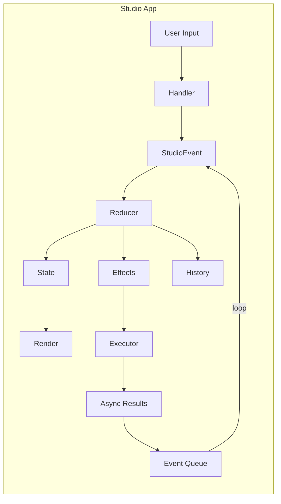

# Studio Internals

**Architectural documentation for developers contributing to Iris Studio.**

Iris Studio is a terminal UI (TUI) built with Ratatui that provides a unified interface for all Git-Iris capabilities. This documentation explains the core architectural patterns, design decisions, and implementation philosophy.

## Philosophy

Studio follows three core principles:

1. **Predictable State Management** — Pure reducer pattern borrowed from frontend frameworks (Redux, Elm)
2. **Event-Driven Architecture** — All state changes flow through a central event system
3. **Separation of Concerns** — Clear boundaries between state, rendering, and effects

## Architecture Overview



**Data Flow:** User Input → Handler → Event → Reducer → (State, Effects, History) → Render/Execute → Event Queue → loop

### Key Components

| Component      | Location         | Purpose                                             |
| -------------- | ---------------- | --------------------------------------------------- |
| **State**      | `state/mod.rs`   | Single source of truth for all UI state             |
| **Events**     | `events.rs`      | 30+ event variants for all state transitions        |
| **Reducer**    | `reducer/mod.rs` | Pure function: `(state, event) → (state', effects)` |
| **Handlers**   | `handlers/`      | Map user input to events                            |
| **Components** | `components/`    | Reusable UI widgets with local state                |
| **History**    | `history.rs`     | Complete audit trail, session persistence           |
| **App**        | `app/mod.rs`     | Event loop, rendering, effect execution             |

## Why This Architecture?

### The Problem

Interactive TUIs face unique challenges:

- **Async operations** (LLM calls, git operations) mixed with UI updates
- **Complex state** across multiple modes and panels
- **User input** interleaved with agent responses
- **Debugging** — "how did we get here?" when state is inconsistent

### The Solution: Pure Reducer Pattern

By adopting a **pure reducer**, we get:

1. **Predictability** — Same event + state = same result (testable, debuggable)
2. **Traceability** — Every state change is an event in the history
3. **Separation** — No I/O in state logic, side effects are explicit
4. **Replay** — Can reconstruct any state from event log
5. **Testability** — Pure functions are trivial to test

### The Trade-off

**Cost:** More indirection. Input → Event → Reducer → Effect → Executor.

**Benefit:** Complete control over state flow. No hidden mutations, no race conditions, no "how did that happen?"

## Core Concepts

### State

**Single source of truth** for the entire application. Located in `state/mod.rs`.

```rust
pub struct StudioState {
    pub repo: Option<Arc<GitRepo>>,
    pub git_status: GitStatus,
    pub config: Config,
    pub active_mode: Mode,
    pub focused_panel: PanelId,
    pub modes: ModeStates,  // Per-mode state
    pub modal: Option<Modal>,
    pub chat_state: ChatState,
    pub notifications: VecDeque<Notification>,
    pub iris_status: IrisStatus,
    pub dirty: bool,
}
```

**Key characteristics:**

- Owned by `StudioApp`
- Mutated only by the reducer
- Read-only for rendering

### Events

**All state changes are events.** Located in `events.rs`.

```rust
pub enum StudioEvent {
    // User input
    KeyPressed(KeyEvent),
    Mouse(MouseEvent),

    // Navigation
    SwitchMode(Mode),
    FocusPanel(PanelId),

    // Content generation
    GenerateCommit { instructions, preset, use_gitmoji },
    GenerateReview { from_ref, to_ref },
    ChatMessage(String),

    // Agent responses
    AgentStarted { task_type },
    AgentProgress { task_type, tool_name, message },
    AgentComplete { task_type, result },

    // Tool-triggered (agent controls UI)
    UpdateContent { content_type, content },
    LoadData { data_type, from_ref, to_ref },

    // Git operations
    RefreshGitStatus,
    StageFile(PathBuf),

    // UI updates
    Notify { level, message },
    Scroll { direction, amount },

    // Lifecycle
    Tick,
    Quit,
}
```

Events come from three sources:

1. **User** — Keyboard, mouse
2. **Agent** — LLM responses, tool calls
3. **System** — Tick, async task completion

### Side Effects

**Effects are data returned by the reducer.** Located in `events.rs`.

The reducer is **pure** (no I/O), so effects describe operations for the app to execute:

```rust
pub enum SideEffect {
    SpawnAgent { task: AgentTask },
    LoadData { data_type, from_ref, to_ref },
    GitStage(PathBuf),
    GitUnstage(PathBuf),
    SaveSettings,
    RefreshGitStatus,
    CopyToClipboard(String),
    ExecuteCommit { message },
    Quit,
}
```

After the reducer returns, `StudioApp::execute_effects()` performs I/O:

- Spawn async agent tasks
- Execute git commands
- Save config to disk
- Copy to clipboard

### History

**Complete audit trail** of all events, modes, and content. Located in `history.rs`.

```rust
pub struct History {
    pub events: Vec<TimestampedEvent>,
    pub mode_history: Vec<ModeSwitch>,
    pub content_history: Vec<ContentSnapshot>,
    pub chat_messages: Vec<ChatMessage>,
}
```

Use cases:

- **Debugging** — "What events led to this state?"
- **Session persistence** — Save/restore entire session
- **Analytics** — Which modes are used most?
- **Replay** — Reconstruct any state from events

## Data Flow Example

Let's trace a commit message generation:

```
1. User presses 'g' in Commit mode
   ↓
2. Handler: handle_commit_key()
   Returns: GenerateCommit { instructions: None, preset: "default", use_gitmoji: true }
   ↓
3. Reducer: reduce()
   - state.modes.commit.generating = true
   - state.iris_status = Thinking { task: "Generating..." }
   - history.record_agent_start(Commit)
   Returns: [SpawnAgent { task: Commit {...} }]
   ↓
4. Executor: execute_effects()
   - Spawns async agent task
   - Task sends progress events via channel
   ↓
5. Agent completes, sends event via channel:
   AgentComplete { task_type: Commit, result: CommitMessages([...]) }
   ↓
6. Event loop receives async result, converts to event
   ↓
7. Reducer: reduce()
   - state.modes.commit.messages = result
   - state.modes.commit.generating = false
   - state.iris_status = Idle
   - history.record_agent_complete(Commit, true)
   Returns: []
   ↓
8. Render: render_commit_panel()
   - Displays generated messages in UI
```

**Notice:** No I/O in reducer, state updates are synchronous, async results feed back as events.

## Directory Structure

```
src/studio/
├── state/
│   ├── mod.rs         # Main StudioState, Mode, Modal types
│   ├── chat.rs        # ChatState, ChatMessage
│   └── modes.rs       # Per-mode state structs
│
├── events.rs          # StudioEvent, SideEffect, TaskType
│
├── reducer/
│   ├── mod.rs         # Main reduce() function
│   ├── modal.rs       # Modal-specific state transitions
│   └── navigation.rs  # Panel/mode navigation logic
│
├── handlers/
│   ├── mod.rs         # Main handler dispatch
│   ├── commit.rs      # Commit mode key handler
│   ├── explore.rs     # Explore mode key handler
│   ├── review.rs      # Review mode key handler
│   └── modals/        # Modal-specific handlers
│       ├── chat.rs
│       ├── settings.rs
│       └── ...
│
├── components/
│   ├── mod.rs         # Component re-exports
│   ├── file_tree.rs   # FileTreeState + render
│   ├── code_view.rs   # CodeViewState + render
│   ├── diff_view.rs   # DiffViewState + render
│   └── message_editor.rs  # MessageEditorState + render
│
├── render/
│   ├── commit.rs      # render_commit_panel()
│   ├── explore.rs     # render_explore_panel()
│   ├── review.rs      # render_review_panel()
│   └── modals.rs      # Modal rendering
│
├── app/
│   ├── mod.rs         # Main event loop
│   └── agent_tasks.rs # Async agent spawning
│
├── history.rs         # History tracking
├── layout.rs          # Layout calculation
└── theme.rs           # SilkCircuit color palette
```

## Next Steps

- **[Reducer Pattern](./reducer.md)** — Deep dive into `reduce()` function
- **[Event System](./events.md)** — Event types and flow
- **[Components](./components.md)** — Reusable UI widgets

## Design Principles

1. **State is sacred** — Only the reducer mutates it
2. **Events are data** — Serializable, traceable, replayable
3. **Effects are explicit** — No hidden I/O
4. **Components are dumb** — Rendering only, no business logic
5. **Handlers are thin** — Map input to events, minimal logic

## Common Patterns

### Adding a New Event

1. Add variant to `StudioEvent` in `events.rs`
2. Add match arm in `reduce()` in `reducer/mod.rs`
3. Optionally add handler logic in `handlers/`
4. Update history recording if needed

### Adding a New Mode

1. Add variant to `Mode` enum in `state/mod.rs`
2. Add mode state struct to `modes.rs`
3. Add render function in `render/`
4. Add handler in `handlers/`
5. Add mode switch logic in `reduce()`

### Adding a New Component

1. Create state struct (e.g., `MyComponentState`)
2. Implement rendering logic
3. Add to `components/mod.rs`
4. Use in mode render functions

### Spawning Agent Tasks

1. Create `SideEffect::SpawnAgent { task }`
2. Return from reducer
3. Executor spawns async task
4. Task sends `AgentComplete` event when done
5. Reducer handles completion, updates state

## Testing Strategy

**Reducer functions are pure** → Easy to test:

```rust
#[test]
fn test_switch_mode() {
    let mut state = StudioState::new(config, None);
    let event = StudioEvent::SwitchMode(Mode::Review);
    let effects = reduce(&mut state, event, &mut history);

    assert_eq!(state.active_mode, Mode::Review);
    assert!(effects.iter().any(|e| matches!(e, SideEffect::LoadData { .. })));
}
```

**Components are stateless renders** → Test with fixtures:

```rust
#[test]
fn test_file_tree_render() {
    let state = FileTreeState::with_files(vec![...]);
    let buffer = render_to_buffer(state);
    assert!(buffer.contains("src/main.rs"));
}
```

## Performance Considerations

**State updates are fast** — Simple struct mutations in reducer.

**Rendering is efficient** — Ratatui's double buffering, only redraw when `dirty` flag is set.

**Effect execution is async** — Git operations and LLM calls happen in background, don't block UI.

**Event queue** — Batches rapid events (e.g., mouse scroll) into single render.

## Debugging

**Event history** — Check `history.events` to see what happened.

**State inspector** — `dbg!(&state)` in reducer to inspect state.

**Effect logging** — Log every effect execution to trace I/O.

**Dirty flag** — If UI doesn't update, check if `state.dirty` is being set.

## Glossary

| Term          | Meaning                                             |
| ------------- | --------------------------------------------------- |
| **Reducer**   | Pure function: `(state, event) → (state', effects)` |
| **Event**     | Data describing a state transition                  |
| **Effect**    | Data describing an I/O operation                    |
| **Handler**   | Maps user input to events                           |
| **Component** | Reusable UI widget with local state                 |
| **Mode**      | High-level view (Commit, Review, PR, etc.)          |
| **Panel**     | Sub-section of a mode (Left, Center, Right)         |
| **Modal**     | Overlay dialog (Help, Chat, Settings)               |
| **History**   | Audit trail of all events and content               |
