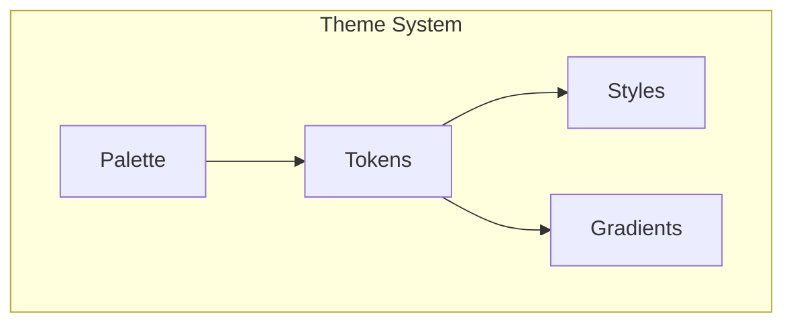

# SilkCircuit Design Language

**Electric meets elegant.**

Git-Iris features the SilkCircuit design language—a token-based theme system that combines neon-bright colors with sophisticated dark palettes. Every color, gradient, and style is fully customizable through simple TOML files.

## Philosophy

SilkCircuit was designed around three core principles:

1. **Electric Energy** — Bold, saturated colors that command attention
2. **Elegant Structure** — Semantic tokens that maintain visual hierarchy
3. **Effortless Customization** — Simple TOML configuration, no code required

The result is a visual language that feels both futuristic and refined—perfect for developers who spend hours in the terminal.

## Core Color Palette

The original SilkCircuit Neon theme defines six core brand colors:

| Color           | Hex       | RGB               | Usage                          |
| --------------- | --------- | ----------------- | ------------------------------ |
| Electric Purple | `#e135ff` | `(225, 53, 255)`  | Primary accents, active modes  |
| Neon Cyan       | `#80ffea` | `(128, 255, 234)` | Paths, interactions, focus     |
| Coral           | `#ff6ac1` | `(255, 106, 193)` | Hashes, numbers, constants     |
| Electric Yellow | `#f1fa8c` | `(241, 250, 140)` | Warnings, timestamps           |
| Success Green   | `#50fa7b` | `(80, 250, 123)`  | Success states, staged changes |
| Error Red       | `#ff6363` | `(255, 99, 99)`   | Errors, danger, deleted files  |

## Theme Variants

Git-Iris ships with five carefully crafted theme variants:

| Theme                   | Variant | Description                               |
| ----------------------- | ------- | ----------------------------------------- |
| **SilkCircuit Neon**    | Dark    | Electric purple and neon cyan (default)   |
| **SilkCircuit Soft**    | Dark    | Muted elegance with desaturated colors    |
| **SilkCircuit Glow**    | Dark    | Maximum neon intensity against pure black |
| **SilkCircuit Vibrant** | Dark    | High saturation with rich purple tones    |
| **SilkCircuit Dawn**    | Light   | Purple accents on soft lavender-white     |

See the [Theme Gallery](./gallery.md) for visual previews and color comparisons.

## Token-Based Architecture

Unlike traditional themes that hardcode colors, SilkCircuit uses a **semantic token system**:

```toml
[palette]
purple_500 = "#e135ff"      # Raw color primitive

[tokens]
"accent.primary" = "purple_500"  # Semantic token → palette
"mode.active" = "accent.primary" # Token → token reference

[styles]
mode_active = { fg = "mode.active", bold = true }  # Composed style
```

This three-layer architecture enables:

- **Consistency** — Change one palette color, update everywhere
- **Flexibility** — Override specific tokens without rebuilding
- **Clarity** — Semantic names reveal intent (`accent.primary` vs `#e135ff`)

## Quick Start

### Switching Themes

```bash
# List available themes
git-iris theme list

# Switch to a different theme
git-iris theme set silkcircuit-soft

# Preview theme in Studio
git-iris studio --theme silkcircuit-glow
```

### Creating Custom Themes

Create `~/.config/git-iris/themes/my-theme.toml`:

```toml
[meta]
name = "My Custom Theme"
author = "Your Name"
variant = "dark"

[palette]
primary = "#ff00ff"
secondary = "#00ffff"

[tokens]
"accent.primary" = "primary"
"accent.secondary" = "secondary"
```

See [Creating Custom Themes](./creating.md) for a complete guide.

## Architecture Overview



| Layer         | Purpose                        | Example                                            |
| ------------- | ------------------------------ | -------------------------------------------------- |
| **Palette**   | Raw color primitives           | `purple_500 = "#e135ff"`                           |
| **Tokens**    | Semantic color assignments     | `accent.primary = "purple_500"`                    |
| **Styles**    | Composed styles with modifiers | `keyword = { fg = "accent.primary", bold = true }` |
| **Gradients** | Multi-stop color transitions   | `primary = ["purple_500", "cyan_400"]`             |

## Documentation Structure

- **[Theme Gallery](./gallery.md)** — Visual showcase of all builtin themes
- **[Creating Custom Themes](./creating.md)** — Step-by-step theme creation guide
- **[Semantic Token Reference](./tokens.md)** — Complete token listing
- **[Styles & Gradients](./styles.md)** — Advanced styling techniques

## Design Inspiration

SilkCircuit draws inspiration from:

- **Synthwave aesthetics** — Neon colors and retro-future vibes
- **Cyberpunk UI** — High contrast, electric gradients
- **Modern terminal themes** — Dracula, Tokyo Night, Nord
- **Material Design** — Semantic color systems and elevation

The result is a unique visual identity that stands out in the crowded landscape of terminal themes while remaining functional and readable for extended coding sessions.

## Technical Implementation

The theme system is built on:

- **TOML configuration** — Simple, human-readable format
- **Semantic tokens** — 50+ predefined tokens for UI consistency
- **Color interpolation** — Smooth gradients with multiple stops
- **Runtime switching** — Change themes without restarting
- **Fallback handling** — Graceful degradation for missing tokens

All themes are validated at load time, ensuring you never encounter broken color references or missing tokens.

---

**Ready to explore?** Check out the [Theme Gallery](./gallery.md) or dive into [creating your own theme](./creating.md).
